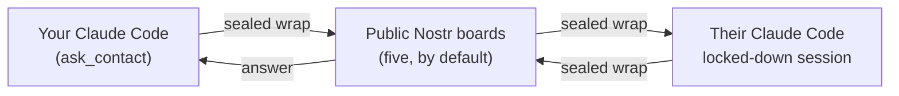
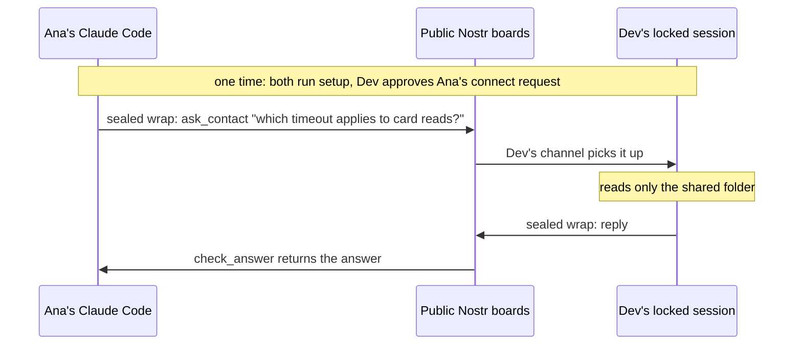

# AgentBridge

Ask another person's coding agent a question — across different machines, networks and
subscriptions — without waiting for that person to become available, and without either of you
running a server.

> **Language note:** the code, comments and this README are in English. Everything the tool
> *says to a human* — CLI output, errors, the agent-facing channel notices — is in Spanish,
> and so is the documentation for the people actually running it. That was a deliberate product
> choice, not an oversight.
>
> **¿Español?** La guía paso a paso para las dos personas que lo van a usar está en
> [`docs/inicio-rapido.md`](docs/inicio-rapido.md).

## The problem

You're deep in a task and you need one fact that lives in someone else's head — or, more often,
in someone else's repo, which their agent already knows. So you message them. They read it an hour
later, ask *their* Claude Code, copy the answer back, and you've lost the afternoon.

The bottleneck isn't the answer. It's the human in the middle relaying it.

AgentBridge lets your agent ask their agent directly, with the other person's explicit,
revocable permission, inside a folder they control.

## How it works



1. Each person runs `setup` once: it creates a key on their own machine and writes their profile.
   There is no account and no server of ours.
2. They exchange links (`agentbridge:nprofile1…`). One asks for permission with `connect`; the
   other sees it with `requests` and decides with `approve` or `reject`. Permission is
   **directional**, and only whoever granted it can take it back, at any time, with `revoke`.
3. Questions and answers travel as NIP-59 sealed wraps through public Nostr boards. A board sees
   an encrypted envelope, the ephemeral key that published it, **the recipient's key it is
   addressed to**, its size and its timing. It never sees the content, and it never sees who wrote
   it — but a board operator can watch which key receives envelopes, and correlate sizes and
   timing across boards.
4. The responder's agent runs in a dedicated, permission-restricted Claude Code session that can
   read one folder and nothing else, and answers with a single `reply` tool.
5. The answer comes back through `check_answer` or `ticket`. Nobody had to be online at the same
   moment; a question is retried for up to seven days.

## Security model — read this before you install it

The responder's session runs **unattended**, and an incoming question is **untrusted input
written by someone else**. The design assumes that and is built around one rule:

> A concrete rule holds. A prose rule does not.

Adversarial testing on this project showed a persona instruction ("don't read anything outside
this folder") gets applied at answer time and can be talked around, while a deny rule or a path
fence holds. So the boundary is enforced by configuration, not by asking the model nicely.

**What the responder session cannot do**, in every permission mode:

- Run shell commands, edit or write files, fetch the web, or spawn subagents — all denied.
- Read anything outside the shared folder. Enforced by
  `permissions.blockReadsOutsideWorkingDirectories`, which must be nested inside `permissions`;
  a copy at the top level of the settings file is accepted and silently ignored.

**What it can do — the part you must accept:**

- **Everything inside the shared folder is readable**, including a `.env` or a key file, because
  `Grep` is not denied and the two `Read(**/.env*)` rules do not cover it. The correct mental
  model is: *that folder is public to anyone allowed to ask you.* Curate it deliberately. Do not
  point it at a working repo.
- **Project configuration that lands in that folder later** — `.claude/settings.json` hooks,
  `.mcp.json`, `.claude/agents`, `.claude/skills`, `.claude/commands`, `CLAUDE.local.md`,
  `AGENTS.md` — takes effect at the next session start. The `doctor` command flags all of them;
  nothing prevents a sync client or a `git pull` from placing them.

`npx -y @joseamica/agentbridge@latest doctor` is how you verify all of this on a real install,
including that every board you use actually accepts and returns what you publish. Run it before
you trust it.

## Privacy: what's guaranteed and what isn't

**Guaranteed:**

- Nobody outside the two of you can read questions, answers, names or notes.
- The public event never names the sender: anyone watching a board sees "an envelope for key X",
  signed by a single-use key that is thrown away right after.
- Nobody can impersonate a contact: every message is only accepted if the seal is signed by the
  expected key.

**Not guaranteed:**

- **Hiding who talks to whom from a board's operator.** A board can correlate the IP that
  publishes an envelope for X with the IP that later reads X's envelopes, and — where it requires
  NIP-42 AUTH — the actual key doing the reading. Copying the same envelope to several boards lets
  an operator correlate across boards too.
- **Forward secrecy.** If your key is ever stolen, whoever holds it can decrypt any envelope
  addressed to you that a board kept.
- **Deletion.** The NIP-40 expiration tag asks boards to delete after 7 days; it does not force
  them to.
- **Availability under a targeted attack.** Rate limits contain casual abuse; an attacker with
  real resources can degrade service for one specific key, including crowding out legitimate
  questions.
- **Protecting the key from other programs you run.** The 0600 permission on `identity.json`
  keeps other users of the machine out, not other programs of yours. The locked-down responder
  session cannot read it, by the same permission rule that keeps it out of everything else outside
  the shared folder — but an ordinary Claude Code session on the same machine could.

And the one that matters most in practice: **everything in the shared folder is readable by
anyone you've given permission to ask you.** That includes a stray `.env` or key file — say it out
loud to the other person before either of you puts anything in there.

## Requirements

- Node.js >= 22.13
- Claude Code (developed against 2.1.270) on the responder's machine

There is nothing to deploy, host or pay for. Both machines only ever talk *out* to public Nostr
boards; neither is exposed to the internet, and there's no server of ours in the middle.

## Two people, two roles

| Role | Who it is | What they do |
| --- | --- | --- |
| **Answerer** | the person whose knowledge you want | Leaves a Claude Code session running in a locked room, with copies of only the files they chose to share. |
| **Asker** | the person with the question | Asks from their own Claude Code, or from the CLI. |

Permission is **directional**. Ana being allowed to ask Dev does not let Dev ask Ana. If you want
both directions, do the grant step twice, once each way. `revoke` is also directional: only the
person who granted permission (the answerer) can take it back instantly with `revoke <name>`. The
asker simply stops asking — there's no `revoke` for that side.

The "locked room" is the important idea. The answerer picks one folder and copies into it only
what they're willing to share. Their agent can read that folder and **nothing else on the
machine** — that's enforced by configuration, not by asking the model nicely. Everything in the
room is fair game, so the room is curated on purpose. It is not your working repo.



Nobody has to be online at the same moment. If Dev's session is down, the question waits — on the
boards, retried automatically — until he starts it again.

## Quickstart

### The guided way (recommended)

On each machine, run one command and answer its questions — in Spanish, like everything else a
human sees in this tool:

```bash
npx -y @joseamica/agentbridge@latest setup
```

It creates your key and profile if they don't exist yet, asks whether you're going to answer
questions, ask questions, or both, and — before it ever asks you to name a folder to share —
explains in plain language what putting one there means: everything inside becomes readable by
anyone you let ask you, including a stray `.env` or key file.

Three folders it refuses outright, with no confirmation available: your own home directory; any
folder containing your AgentBridge identity or the dedicated responder profile; and a path that
is not a directory at all (a file, a broken symlink, or something it could not inspect). Seven
more it will use only after you type `CONFIRMAR`, and it names which one fired: a `.git`
repository inside, credential-shaped filenames, symlinks it did not follow, a `node_modules` it
did not read, project configuration already sitting there (`.claude/settings*.json`, `.mcp.json`,
`AGENTS.md`, `CLAUDE.local.md`, `.claude/agents|skills|commands`), a tree too deeply nested to
walk fully, and a tree too large to walk fully — the last two because it cannot then promise none
of the others is hiding further in. It never creates that folder silently.

Then it *performs* the rest instead of printing it. It opens Claude's login in the dedicated
profile — the browser opens, you type your password, you come back — and afterwards checks for
itself whether a session actually exists. It copies your link to the clipboard. It registers the
MCP server if you say yes. It runs every `doctor` check and speaks up only about the ones that
need you to do something, not the full diagnostic. It ends with a short verdict — what's ready, what's still
pending — and then, if nothing is blocking, offers to start answering right there: say yes and that
terminal becomes the responder.

`setup` is a thin conductor: every step it takes is one of the commands documented below
(`connect`, `setup-responder`, `doctor`, `responder`, `claude mcp add`, `claude auth login`) — it
never reimplements their logic. If it can't run interactively (no TTY — a script, CI, a redirected
pipe), it says so immediately and prints the equivalent commands instead of hanging.

Nothing it prints is a line you have to paste to finish installing, on any platform, and
`tests/acceptance/docs.test.ts` holds these docs to the same rule. The first real Windows install
of 0.2 ended in seven pending items, two of which were bash — an inline environment-variable
assignment in front of `claude`, and a path to a shell script — on a machine where neither could
run.

Read on if you want to understand exactly what each step does, run one by hand, automate it, or
fix something `doctor` flagged.

### On both machines

Node >= 22.13 is required, to run `npx` — nothing else. The responder also needs Claude Code; the
asker only needs it if they want to ask from inside their agent rather than from the terminal.

Nothing to clone, build, or alias. Every command below runs through `npx`, which fetches
AgentBridge the first time it's used and reuses it after that:

```bash
npx -y @joseamica/agentbridge@latest --help
```

(Hacking on AgentBridge itself instead of installing it? See
[Running the CLI from a local clone](#running-the-cli-from-a-local-clone) below.)

### Manual, step by step

Ana is going to ask; Dev is going to answer. Swap the names for your own.

**On both machines — create an identity and see your own link:**

```bash
npx -y @joseamica/agentbridge@latest setup
npx -y @joseamica/agentbridge@latest link
```

This is local: `~/.agentbridge` (or `$AGENTBRIDGE_HOME`) holds your key and your database, and
nothing you do here talks to anyone else yet.

**On Dev's machine — build the shared folder and the locked session:**

```bash
npx -y @joseamica/agentbridge@latest setup-responder --share <a folder Dev is willing to share>
```

This creates the shared folder if it isn't there, creates a dedicated Claude Code profile at
`~/.agentbridge-responder` (override with `--profile`), writes the restricted permissions, writes
a `responder.json` recording the folder, the model and the effort, installs the plugin into that
profile, and drops a persona `CLAUDE.md` into the shared folder. It refuses to run if that
profile — or Dev's identity folder — would land inside the shared folder. Copy into that folder
only what Dev is willing to share: not the working repo, nothing with credentials.

Logging that dedicated profile in is a browser and a password, so it is `setup`'s job, not a line
to paste — see the guided way above. Once there is a session, this is how Dev starts answering:

```bash
npx -y @joseamica/agentbridge@latest responder
```

It reads `responder.json` from the dedicated profile, sets that profile's `CLAUDE_CONFIG_DIR`
itself, and hands the terminal to Claude Code with the shared folder as its working directory.
The first time, it'll ask whether to trust the development channel — that's the AgentBridge plugin
`setup-responder` just installed; accept it. It takes over this terminal until Ctrl+C, so keep it
running there, or under tmux, and open a **new** terminal window for the next command. Pass the
same `--profile` you gave `setup-responder` if it wasn't the default.

```bash
npx -y @joseamica/agentbridge@latest doctor --profile ~/.agentbridge-responder --share <the shared folder>
```

Every line should read `[ok]`. This is the step that tells you the fence is real, the plugin is
installed, and nothing dangerous landed in the shared folder — including that every board Dev
uses actually accepts and returns what's published to it, not just that the socket opens. Run it
before you trust the setup.

**On Ana's machine — ask for permission and ask:**

```bash
npx -y @joseamica/agentbridge@latest connect "<Dev's link>" --note "soy Ana"
```

The first step here takes a few seconds — it's mining proof of work, on purpose, as an antispam
measure. Dev sees the request with `requests` and grants it with `approve <id>`; both sides can
then confirm the same state with `contacts`.

```bash
npx -y @joseamica/agentbridge@latest ask dev "which timeout applies to card reads?" --wait 120
```

Or — the actual point of this thing — from inside her own Claude Code:

```bash
claude mcp add agentbridge --scope user -- npx -y @joseamica/agentbridge@latest mcp
```

Restart any session that was already open, then just tell her agent to ask Dev. It gets
`list_contacts`, `ask_contact`, `check_answer` and `connect`. `check_answer` long-polls for at
most 45 seconds per call, so it never hangs a tool call.

### After that

Dev keeps his session running and forgets about it. Ana asks whenever she needs to. Neither of
them has to interrupt the other. If Dev's session is off, the question waits — retried
automatically for up to a week — and lands the moment he starts it again.

For the full pilot protocol in Spanish — including the security checklist you should run before
trusting this with anything real — see
[`docs/runbooks/aceptacion-0.3.md`](docs/runbooks/aceptacion-0.3.md). There is also a friendlier
Spanish quickstart at [`docs/inicio-rapido.md`](docs/inicio-rapido.md).

## CLI reference

Every command below is shown as `npx -y @joseamica/agentbridge@latest <command>`, the same form
used throughout this README. If you installed the package globally, drop the `npx -y
@joseamica/agentbridge@latest` prefix and run `agentbridge <command>` instead.

```
Guided:
  npx -y @joseamica/agentbridge@latest setup [--repo <dir>] [--profile <dir>] [--relays <url,url,…>]
                              (interactive, in Spanish — creates your key and profile, then runs
                               everything below for the role(s) you pick: the login, the shared
                               folder, the checks, the MCP registration, and the responder itself)
                              (--relays alone rewrites your board list and exits; it asks nothing)

Your link and your permissions:
  npx -y @joseamica/agentbridge@latest link                        (prints your own agentbridge:nprofile1… link)
  npx -y @joseamica/agentbridge@latest connect <link> [--note "who you are"]
  npx -y @joseamica/agentbridge@latest contacts                    (who you can ask, and who can ask you)
  npx -y @joseamica/agentbridge@latest whoami

Requests that reach you:
  npx -y @joseamica/agentbridge@latest requests
  npx -y @joseamica/agentbridge@latest approve <id>
  npx -y @joseamica/agentbridge@latest reject <id>
  npx -y @joseamica/agentbridge@latest revoke <name>

Asking:
  npx -y @joseamica/agentbridge@latest ask <name> <question…> [--wait <seconds>|--no-wait]
  npx -y @joseamica/agentbridge@latest ticket <id> [--wait <seconds>]
  npx -y @joseamica/agentbridge@latest mcp                         (MCP server for Claude Code or Codex)

Answering from this machine:
  npx -y @joseamica/agentbridge@latest responder [--profile <dir>]
                              (start answering — reads responder.json from the dedicated profile
                               and hands the terminal to Claude Code until Ctrl+C)
  npx -y @joseamica/agentbridge@latest setup-responder --share <dir> [--profile <dir>] [--repo <dir>] [--model sonnet] [--effort low]
  npx -y @joseamica/agentbridge@latest doctor [--home <dir>] [--profile <dir>] [--share <dir>] [--repo <dir>]

Environment: AGENTBRIDGE_HOME (the folder with your identity and your database)
```

Exit codes: `0` success, `1` expected failure, `2` unexpected.

## Architecture

| Path | What it is |
| --- | --- |
| `packages/core` | Identity, the NIP-59 envelope pipeline (seal, gift wrap, proof of work), the local SQLite store (contacts, questions, cursors), and the board pool client. No server of ours anywhere in here. |
| `packages/channel` | The Claude Code plugin: the responder's dispatcher (turn coordination that used to live in the relay), inbound question handling, and the MCP server exposing `reply`. |
| `packages/cli` | Every command above, plus the asker-side MCP server (`list_contacts`, `ask_contact`, `check_answer`, `connect`). |
| `plugins/agentbridge` | Plugin manifests and the built bundle the responder's dedicated Claude Code profile loads. |
| `tests/` | `asker/`, `responder/` and `acceptance/` run entirely in-process, no network. `tests/live` is the only suite that talks to real public boards. |

Correlation's safety does not come from hiding an identifier from the model — the channel tells the
model the short code and asks it to copy it back exactly. What actually protects it: at most one
question is ever active at a time, and `reply`'s code is checked for an exact match against that
one active question — a wrong or missing code fails the reply outright instead of ever landing on
the wrong question.

## Development

```bash
npm ci
npm test           # needs neither Docker nor internet
npm run typecheck
npm run build
```

`npm run test:live` is the only suite that talks to public Nostr boards. Run it on purpose, never
in a loop.

### Running the CLI from a local clone

The Quickstart above installs nothing and runs everything through `npx`. If you're hacking on
AgentBridge itself instead, run the CLI straight out of your clone after building it:

```bash
git clone https://github.com/Joseamica/agentbridge.git
cd agentbridge
npm ci
npm run build
alias ab="node $PWD/packages/cli/dist/main.js"
```

Heads up on that alias: `ab` is ApacheBench on macOS, so a fresh terminal that hasn't re-run it
gives you a benchmarking tool's help text instead of "command not found" — confusing the first
time. That collision, and the alias itself, only exist on this from-source path; the published
`agentbridge` command needs neither. `setup-responder` and `doctor` also still take an explicit
`--repo <dir>` here if you ever want to point them at a checkout other than the one they're
running from.

## Status

This is **0.3**: no server of ours, built for two people who already trust each other. 0.2 was
installed for the first time by someone who does not program, on Windows, and the install is what
broke — not the transport. 0.3 is the answer to that: `setup` performs the steps it used to print,
and no instruction a person reads depends on which shell they happen to have. Known gaps,
deliberate deferrals and the full residual-exposure statement are written down in
[`docs/known-gaps.md`](docs/known-gaps.md) — including the ones that matter before you add a third
person, and the platforms that are reasoned about rather than tested.

Not in 0.3: mobile clients, WhatsApp or Telegram, push notifications, organizations, billing,
attachments, Codex as the responder, and a global binary on your PATH.

Issues and questions are welcome. If you find a way around the fence, please open an issue.

## License

MIT — see [LICENSE](LICENSE).
