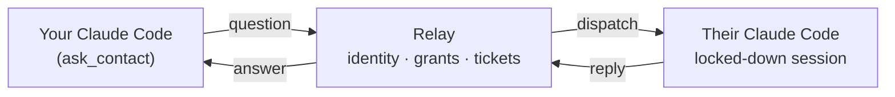

# AgentBridge

Ask another person's coding agent a question — across different machines, networks and
subscriptions — without waiting for that person to become available.

> **Language note:** the code, comments and this README are in English. Everything the tool
> *says to a human* — CLI output, errors, the agent-facing channel notices — is in Spanish,
> and so is the acceptance runbook. That was a deliberate product choice, not an oversight.

## The problem

You're deep in a task and you need one fact that lives in someone else's head — or, more often,
in someone else's repo, which their agent already knows. So you message them. They read it an hour
later, ask *their* Claude Code, copy the answer back, and you've lost the afternoon.

The bottleneck isn't the answer. It's the human in the middle relaying it.

AgentBridge lets your agent ask their agent directly, with the other person's explicit,
revocable permission, inside a box they control.

## How it works



1. Both people enroll once against a relay you host. Credentials never travel agent-to-agent.
2. One grants the other permission to ask. Grants are **directional** and revocable at any time.
3. The asker's agent calls `ask_contact`. The relay queues a ticket.
4. The responder's agent — running in a dedicated, permission-restricted Claude Code session —
   receives the question as a channel notification and answers with a single `reply` tool.
5. The answer comes back through `check_answer`. Nobody had to be online at the same moment.

## Security model — read this before you install it

The responder's session runs **unattended**, and an incoming question is **untrusted input
written by someone else**. The design assumes that and is built around one rule:

> A concrete rule holds. A prose rule does not.

Adversarial testing on this project showed a persona instruction ("don't read anything outside
this folder") gets applied at answer time and can be talked around, while a deny rule or a path
fence holds. So the boundary is enforced by configuration, not by asking the model nicely.

**What the responder session cannot do**, in every permission mode:

- Run shell commands, edit or write files, fetch the web, or spawn subagents — all denied.
- Read anything outside the shared folder. Enforced by
  `permissions.blockReadsOutsideWorkingDirectories`, which must be nested inside `permissions`;
  a copy at the top level of the settings file is accepted and silently ignored.

**What it can do — the part you must accept:**

- **Everything inside the shared folder is readable**, including a `.env` or a key file, because
  `Grep` is not denied and the two `Read(**/.env*)` rules do not cover it. The correct mental
  model is: *that folder is public to anyone allowed to ask you.* Curate it deliberately. Do not
  point it at a working repo.
- **Project configuration that lands in that folder later** — `.claude/settings.json` hooks,
  `.mcp.json`, `.claude/agents`, `.claude/skills`, `.claude/commands`, `CLAUDE.local.md`,
  `AGENTS.md` — takes effect at the next session start. `agentbridge doctor` flags all of them;
  nothing prevents a sync client or a `git pull` from placing them.
- **Whoever runs the relay reads everything.** Question and answer content is stored in plaintext
  for 7 days. Device tokens are stored only as SHA-256 hashes, but the relay operator holds the
  admin token and is the identity provider. Run your own relay, and tell your counterpart that
  you do.

`agentbridge doctor` is how you verify all of this on a real install. Run it before you trust it.

## Requirements

- Node.js >= 22.4 (developed on 24)
- Claude Code (developed against 2.1.270) on the responder's machine
- Postgres 16 for the relay — Docker locally, a managed instance in production
- A host for the relay. A `render.yaml` blueprint is included.

## Quickstart

### 1. Build

```bash
git clone https://github.com/Joseamica/agentbridge.git
cd agentbridge
npm ci
npm run build
```

That produces two bundles: the CLI at `packages/cli/dist/main.js` and the Claude Code plugin
server at `plugins/agentbridge/dist/server.js`.

A convenient alias — note that `ab` is ApacheBench on macOS, so without this you will get its
usage text rather than a "command not found":

```bash
alias ab="node $PWD/packages/cli/dist/main.js"
```

### 2. Deploy the relay

Deploy with the included `render.yaml`, or run it anywhere that gives you Postgres and a public
URL. Set `ADMIN_TOKEN` to a long random string and keep it in a password manager — it mints
enrollment links, so it is the master credential. `PUBLIC_URL` falls back to Render's
`RENDER_EXTERNAL_URL` if unset.

### 3. Enroll both people

The relay operator issues a one-time link per person (single use, expiring, bound to the first
device that redeems it):

```bash
read -rs AGENTBRIDGE_ADMIN_TOKEN && export AGENTBRIDGE_ADMIN_TOKEN
export AGENTBRIDGE_RELAY_URL=https://your-relay.example.com

ab admin enroll-link --handle dev --name "Dev"
ab admin enroll-link --handle ana --name "Ana"
```

Each person redeems their own link on their own machine:

```bash
ab enroll "<link>"
ab whoami
```

### 4. Grant permission

The person who will *answer* creates an invite; the person who will *ask* accepts it:

```bash
ab invite            # responder runs this, sends the link over any channel
ab accept "<link>"   # asker runs this
ab contacts          # either side, to see who can ask whom
ab revoke ana        # responder, at any time
```

### 5. Set up the responder session

```bash
ab setup-responder --share ~/AgentBridge/shared --repo "$PWD"
```

This creates a dedicated `CLAUDE_CONFIG_DIR` profile, writes the restricted settings, generates a
`start.sh`, and drops a persona `CLAUDE.md` into the shared folder. It refuses to run if the home
directory would land inside the shared folder. Log in once in that profile, then:

```bash
~/.agentbridge-responder/start.sh
ab doctor --home ~/.agentbridge-responder --share ~/AgentBridge/shared --repo "$PWD"
```

### 6. Ask

From the CLI:

```bash
ab ask dev "which timeout applies to card reads?" --wait 120
```

Or from inside your own Claude Code, which is the point:

```bash
claude mcp add agentbridge --scope user -- node "$PWD/packages/cli/dist/main.js" mcp
```

Then just ask your agent to ask theirs. It gets `list_contacts`, `ask_contact` and
`check_answer`; `check_answer` long-polls within the relay's ceiling so it never hangs a tool call.

The full step-by-step acceptance runbook, in Spanish, with an eight-scenario security checklist,
is at [`docs/runbooks/m1-acceptance.md`](docs/runbooks/m1-acceptance.md).

## CLI reference

```
Enrollment and permissions:
  agentbridge admin enroll-link --handle <h> --name <name> --relay <url> --admin-token <token>
  agentbridge enroll <link> [--device <name>]
  agentbridge whoami
  agentbridge invite
  agentbridge accept <link>
  agentbridge contacts
  agentbridge revoke <handle>

Asking:
  agentbridge ask <handle> <question…> [--wait <seconds>|--no-wait]
  agentbridge ticket <ticket_id> [--wait <seconds>]
  agentbridge mcp

Answering from this machine:
  agentbridge setup-responder --share <dir> [--home <dir>] [--repo <dir>] [--model sonnet] [--effort low]
  agentbridge doctor [--home <dir>] [--share <dir>] [--repo <dir>]

Environment: AGENTBRIDGE_HOME, AGENTBRIDGE_RELAY_URL, AGENTBRIDGE_ADMIN_TOKEN
```

Exit codes: `0` success, `1` expected failure, `2` unexpected.

## Architecture

| Path | What it is |
| --- | --- |
| `apps/relay` | Fastify + Postgres. Identity, directional grants, tickets, per-pair limits, WebSocket hub, sweeper. |
| `packages/core` | Wire protocol (zod), secret hashing, client config, HTTP client. |
| `packages/channel` | The Claude Code plugin: relay WebSocket client, in-flight question state, MCP server exposing `reply`. |
| `packages/cli` | Every command above, plus the asker-side MCP server. |
| `plugins/agentbridge` | Plugin manifests and the built bundle. |
| `tests/e2e` | One hermetic end-to-end test: real relay, real Postgres, real WebSocket, real MCP pairs. |

Correlation deliberately never depends on the model copying an identifier: the relay validates an
`attemptId` the model never sees, and the human-facing question code is checked for an exact match.

## Development

```bash
npm ci
npm run db:up      # Postgres 16 in Docker on port 55432
npm test           # 187 tests
npm run typecheck
npm run build
npm run db:down
```

Tests only ever talk to the Docker container on port 55432.

## Status

This is **M1**: pilot-grade, built for two people who already trust each other. It has been
reviewed end to end, but it has not been run by anyone but its author. Known gaps, deliberate
deferrals and the full residual-exposure statement are written down in
[`docs/known-gaps.md`](docs/known-gaps.md)
— including the ones that matter before you add a third person.

Not in M1: mobile clients, WhatsApp or Telegram, push notifications, organizations, billing,
attachments, Codex as the responder.

Issues and questions are welcome. If you find a way around the fence, please open an issue.

## License

MIT — see [LICENSE](LICENSE).
