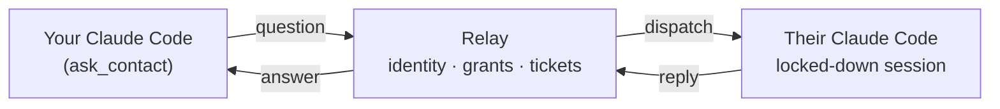
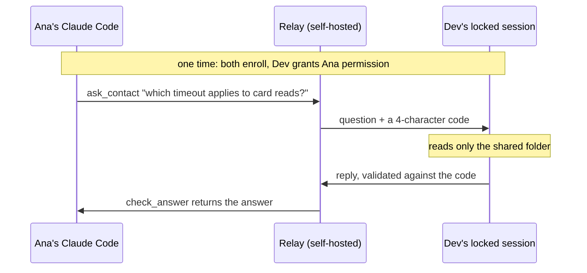

# AgentBridge

Ask another person's coding agent a question — across different machines, networks and
subscriptions — without waiting for that person to become available.

> **Language note:** the code, comments and this README are in English. Everything the tool
> *says to a human* — CLI output, errors, the agent-facing channel notices — is in Spanish,
> and so is the documentation for the people actually running it. That was a deliberate product
> choice, not an oversight.
>
> **¿Español?** La guía paso a paso para las dos personas que lo van a usar está en
> [`docs/inicio-rapido.md`](docs/inicio-rapido.md).

## The problem

You're deep in a task and you need one fact that lives in someone else's head — or, more often,
in someone else's repo, which their agent already knows. So you message them. They read it an hour
later, ask *their* Claude Code, copy the answer back, and you've lost the afternoon.

The bottleneck isn't the answer. It's the human in the middle relaying it.

AgentBridge lets your agent ask their agent directly, with the other person's explicit,
revocable permission, inside a box they control.

## How it works



1. Both people enroll once against a relay you host. Credentials never travel agent-to-agent.
2. One grants the other permission to ask. Grants are **directional** and revocable at any time.
3. The asker's agent calls `ask_contact`. The relay queues a ticket.
4. The responder's agent — running in a dedicated, permission-restricted Claude Code session —
   receives the question as a channel notification and answers with a single `reply` tool.
5. The answer comes back through `check_answer`. Nobody had to be online at the same moment.

## Security model — read this before you install it

The responder's session runs **unattended**, and an incoming question is **untrusted input
written by someone else**. The design assumes that and is built around one rule:

> A concrete rule holds. A prose rule does not.

Adversarial testing on this project showed a persona instruction ("don't read anything outside
this folder") gets applied at answer time and can be talked around, while a deny rule or a path
fence holds. So the boundary is enforced by configuration, not by asking the model nicely.

**What the responder session cannot do**, in every permission mode:

- Run shell commands, edit or write files, fetch the web, or spawn subagents — all denied.
- Read anything outside the shared folder. Enforced by
  `permissions.blockReadsOutsideWorkingDirectories`, which must be nested inside `permissions`;
  a copy at the top level of the settings file is accepted and silently ignored.

**What it can do — the part you must accept:**

- **Everything inside the shared folder is readable**, including a `.env` or a key file, because
  `Grep` is not denied and the two `Read(**/.env*)` rules do not cover it. The correct mental
  model is: *that folder is public to anyone allowed to ask you.* Curate it deliberately. Do not
  point it at a working repo.
- **Project configuration that lands in that folder later** — `.claude/settings.json` hooks,
  `.mcp.json`, `.claude/agents`, `.claude/skills`, `.claude/commands`, `CLAUDE.local.md`,
  `AGENTS.md` — takes effect at the next session start. `agentbridge doctor` flags all of them;
  nothing prevents a sync client or a `git pull` from placing them.
- **Whoever runs the relay reads everything.** Question and answer content is stored in plaintext
  for 7 days. Device tokens are stored only as SHA-256 hashes, but the relay operator holds the
  admin token and is the identity provider. Run your own relay, and tell your counterpart that
  you do.

`agentbridge doctor` is how you verify all of this on a real install. Run it before you trust it.

## Requirements

- Node.js >= 22.4 (developed on 24)
- Claude Code (developed against 2.1.270) on the responder's machine
- Postgres 16 for the relay — Docker locally, a managed instance in production
- A host for the relay. A `render.yaml` blueprint is included.

## Two people, two roles

The two machines never talk to each other and neither is exposed to the internet. Both call *out*
to a relay you host — think of it as a reception desk both people trust.

There are three roles. In a two-person pilot one person usually holds two of them.

| Role | Who it is | What they do |
| --- | --- | --- |
| **Relay operator** | whoever hosts it, usually you | Deploys the relay once and issues one enrollment link per person. Can read every question and answer — say that out loud to the other person. |
| **Answerer** | the person whose knowledge you want | Leaves a Claude Code session running in a locked room, with copies of only the files they chose to share. |
| **Asker** | the person with the question | Asks from their own Claude Code, or from the CLI. |

Permission is **directional**. Ana being allowed to ask Dev does not let Dev ask Ana. If you want
both directions, do the grant step twice, once each way. Either side can revoke instantly.

The "locked room" is the important idea. The answerer picks one folder and copies into it only
what they're willing to share. Their agent can read that folder and **nothing else on the
machine** — that's enforced by configuration, not by asking the model nicely. Everything in the
room is fair game, so the room is curated on purpose. It is not your working repo.



Nobody has to be online at the same moment. If Dev's session is down, the question waits in the
queue for him.

## Quickstart

### The guided way (recommended)

On each machine, run one command and answer its questions — in Spanish, like everything else a
human sees in this tool:

```bash
npx -y agentbridge@latest setup
```

It enrolls the device if it isn't already, asks whether you're going to answer questions, ask
questions, or both, and — before it ever asks you to name a folder to share — explains in plain
language what putting one there means: everything inside becomes readable by anyone you let ask
you, including a stray `.env` or key file. It refuses your own home directory outright, and makes
you type an explicit confirmation before using a folder that looks like a working repo or already
has credential-shaped files in it. It never creates that folder silently. It finishes by telling
you plainly what's ready, what's still pending, and the one command to run next.

`setup` is a thin conductor: every step it takes is one of the commands documented below
(`enroll`, `setup-responder`, `doctor`, `claude mcp add`) — it never reimplements their logic. If
it can't run interactively (no TTY — a script, CI, a redirected pipe), it says so immediately and
prints the equivalent commands instead of hanging.

Read on if you want to understand exactly what each step does, run one by hand, automate it, or
fix something `doctor` flagged.

### Manual, step by step

Ana is going to ask; Dev is going to answer. Swap the names for your own.

### On both machines

Node >= 22.4 is required, to run `npx` — nothing else. Dev also needs Claude Code; Ana only needs
it if she wants to ask from inside her agent rather than from the terminal.

Nothing to clone, build, or alias. Every command below runs through `npx`, which fetches
AgentBridge the first time it's used and reuses it after that:

```bash
npx -y agentbridge@latest --help
```

(Hacking on AgentBridge itself instead of installing it? See
[Running the CLI from a local clone](#running-the-cli-from-a-local-clone) below.)

### Once, on the relay operator's machine

Deploy the relay with the included `render.yaml`, or anywhere that gives you Postgres and a public
URL. Set `ADMIN_TOKEN` to a long random string and keep it in a password manager: it mints
enrollment links, so it is the master credential. Never paste it into a chat.

Then issue one link per person — single use, expiring, and bound to the first device that redeems
it:

```bash
read -rs AGENTBRIDGE_ADMIN_TOKEN && export AGENTBRIDGE_ADMIN_TOKEN
export AGENTBRIDGE_RELAY_URL=https://your-relay.example.com

npx -y agentbridge@latest admin enroll-link --handle dev --name "Dev"
npx -y agentbridge@latest admin enroll-link --handle ana --name "Ana"
```

Send each person their own link, over any channel you already use.

### On Dev's machine — the person who answers

`agentbridge setup` does steps 1, 3 and 5 below for you — including the shared-folder safety
checks — and tells you exactly what's left. This is what it runs, spelled out, and how to do any
of it by hand.

**1. Redeem the link — into the responder's own home, not the default one.**

```bash
AGENTBRIDGE_HOME=~/.agentbridge-responder npx -y agentbridge@latest enroll "<Dev's link>"
AGENTBRIDGE_HOME=~/.agentbridge-responder npx -y agentbridge@latest whoami
```

The dedicated session `start.sh` launches later always runs with
`AGENTBRIDGE_HOME=~/.agentbridge-responder` (that is what keeps it from touching Dev's own
everyday Claude Code identity). Enrolling anywhere else — the default `~/.agentbridge` included —
leaves that session with no credential to read, and it exits immediately instead of connecting.
Enrollment links are single-use, so getting this step wrong means going back to the relay operator
for a brand-new one.

**2. Build the room.** Create a folder and copy into it only what Dev is willing to share. A
README, a config file, an architecture note. Not the working repo, and nothing with credentials.

```bash
mkdir -p ~/AgentBridge/shared
```

**3. Set up the locked session.**

```bash
npx -y agentbridge@latest setup-responder --share ~/AgentBridge/shared --home ~/.agentbridge-responder
```

This creates a dedicated Claude Code profile, writes the restricted permissions, generates a
`start.sh`, and drops a persona `CLAUDE.md` into the shared folder. It refuses to run if the
credential directory would land inside the shared folder. (`--home` here defaults to
`~/.agentbridge-responder` already — it's spelled out so it visibly matches step 1.)

**4. Log in once in that profile, then start it.** The session has to stay running to answer —
keep it in its own terminal window, or under tmux.

```bash
~/.agentbridge-responder/start.sh
```

**5. Check it actually works.**

```bash
npx -y agentbridge@latest doctor --home ~/.agentbridge-responder --share ~/AgentBridge/shared
```

Every line should read `[ok]`. This is the step that tells you the fence is real, the plugin is
installed, and nothing dangerous landed in the shared folder. Run it before you trust the setup.

**6. Let Ana in.**

```bash
AGENTBRIDGE_HOME=~/.agentbridge-responder npx -y agentbridge@latest invite
```

Send Ana the link it prints. That is what grants her permission to ask. Dev can undo it at any
time with `AGENTBRIDGE_HOME=~/.agentbridge-responder npx -y agentbridge@latest revoke ana`. Every
command Dev runs about this identity — `invite`, `revoke`, `contacts`, a later `whoami` — needs
that same `AGENTBRIDGE_HOME`, since that is where step 1 put the credential; exporting it once for
the whole terminal session avoids repeating it.

### On Ana's machine — the person who asks

`agentbridge setup` does step 1 and, if she asks it to, registers the MCP server from step 3 too
— reminding her to restart Claude Code afterward. This is what it runs, spelled out, and how to
do any of it by hand.

**1. Redeem her own link.**

```bash
npx -y agentbridge@latest enroll "<Ana's link>"
```

**2. Accept Dev's invite.**

```bash
npx -y agentbridge@latest accept "<Dev's invite link>"
npx -y agentbridge@latest contacts
```

`contacts` should now list Dev under the people she can ask.

**3. Ask.** From the terminal:

```bash
npx -y agentbridge@latest ask dev "which timeout applies to card reads?" --wait 120
```

Or — the actual point of this thing — from inside her own Claude Code:

```bash
claude mcp add agentbridge --scope user -- npx -y agentbridge@latest mcp
```

Restart any session that was already open, then just tell her agent to ask Dev. It gets
`list_contacts`, `ask_contact` and `check_answer`. `check_answer` long-polls within the relay's
ceiling, so it never hangs a tool call.

### After that

Dev keeps his session running and forgets about it. Ana asks whenever she needs to. Neither of
them has to interrupt the other.

For the full pilot protocol in Spanish — including an eight-scenario security checklist you should
run before trusting this with anything real — see
[`docs/runbooks/m1-acceptance.md`](docs/runbooks/m1-acceptance.md). There is also a friendlier
Spanish quickstart at [`docs/inicio-rapido.md`](docs/inicio-rapido.md).

## CLI reference

```
Guided:
  agentbridge setup [--repo <dir>] [--responder-home <dir>]
                              (interactive, in Spanish — orchestrates everything below;
                               both flags are only for running from a source checkout —
                               --responder-home is the responder's dedicated profile dir,
                               not your own identity's)

Enrollment and permissions:
  agentbridge admin enroll-link --handle <h> --name <name> --relay <url> --admin-token <token>
  agentbridge enroll <link> [--device <name>]
  agentbridge whoami
  agentbridge invite
  agentbridge accept <link>
  agentbridge contacts
  agentbridge revoke <handle>

Asking:
  agentbridge ask <handle> <question…> [--wait <seconds>|--no-wait]
  agentbridge ticket <ticket_id> [--wait <seconds>]
  agentbridge mcp

Answering from this machine:
  agentbridge setup-responder --share <dir> [--home <dir>] [--repo <dir>] [--model sonnet] [--effort low]
  agentbridge doctor [--home <dir>] [--share <dir>] [--repo <dir>]

Environment: AGENTBRIDGE_HOME, AGENTBRIDGE_RELAY_URL, AGENTBRIDGE_ADMIN_TOKEN
```

Exit codes: `0` success, `1` expected failure, `2` unexpected.

## Architecture

| Path | What it is |
| --- | --- |
| `apps/relay` | Fastify + Postgres. Identity, directional grants, tickets, per-pair limits, WebSocket hub, sweeper. |
| `packages/core` | Wire protocol (zod), secret hashing, client config, HTTP client. |
| `packages/channel` | The Claude Code plugin: relay WebSocket client, in-flight question state, MCP server exposing `reply`. |
| `packages/cli` | Every command above, plus the asker-side MCP server. |
| `plugins/agentbridge` | Plugin manifests and the built bundle. |
| `tests/e2e` | One hermetic end-to-end test: real relay, real Postgres, real WebSocket, real MCP pairs. |

Correlation deliberately never depends on the model copying an identifier: the relay validates an
`attemptId` the model never sees, and the human-facing question code is checked for an exact match.

## Development

```bash
npm ci
npm run db:up      # Postgres 16 in Docker on port 55432
npm test           # 227 tests
npm run typecheck
npm run build
npm run db:down
```

Tests only ever talk to the Docker container on port 55432.

### Running the CLI from a local clone

The Quickstart above installs nothing and runs everything through `npx`. If you're hacking on
AgentBridge itself instead, run the CLI straight out of your clone after building it:

```bash
git clone https://github.com/Joseamica/agentbridge.git
cd agentbridge
npm ci
npm run build
alias ab="node $PWD/packages/cli/dist/main.js"
```

Heads up on that alias: `ab` is ApacheBench on macOS, so a fresh terminal that hasn't re-run it
gives you a benchmarking tool's help text instead of "command not found" — confusing the first
time. That collision, and the alias itself, only exist on this from-source path; the published
`agentbridge` command needs neither. `setup-responder` and `doctor` also still take an explicit
`--repo <dir>` here if you ever want to point them at a checkout other than the one they're
running from.

## Status

This is **M1**: pilot-grade, built for two people who already trust each other. It has been
reviewed end to end, but it has not been run by anyone but its author. Known gaps, deliberate
deferrals and the full residual-exposure statement are written down in
[`docs/known-gaps.md`](docs/known-gaps.md)
— including the ones that matter before you add a third person.

Not in M1: mobile clients, WhatsApp or Telegram, push notifications, organizations, billing,
attachments, Codex as the responder.

Issues and questions are welcome. If you find a way around the fence, please open an issue.

## License

MIT — see [LICENSE](LICENSE).
